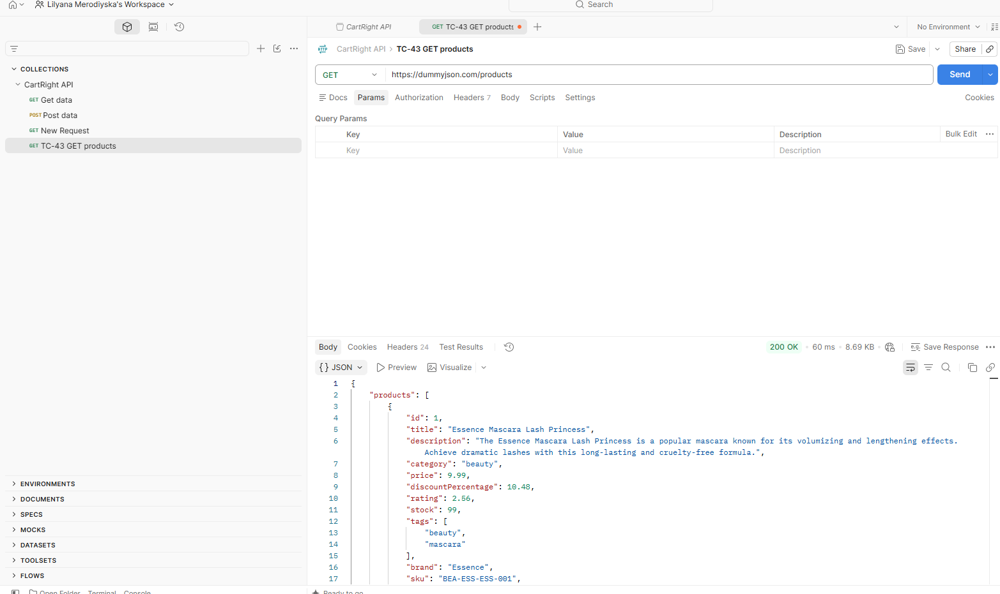
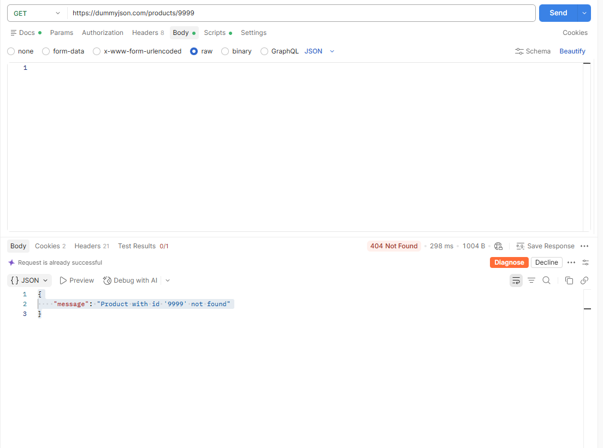
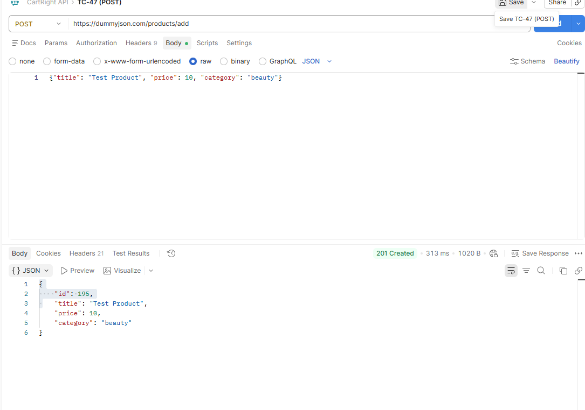
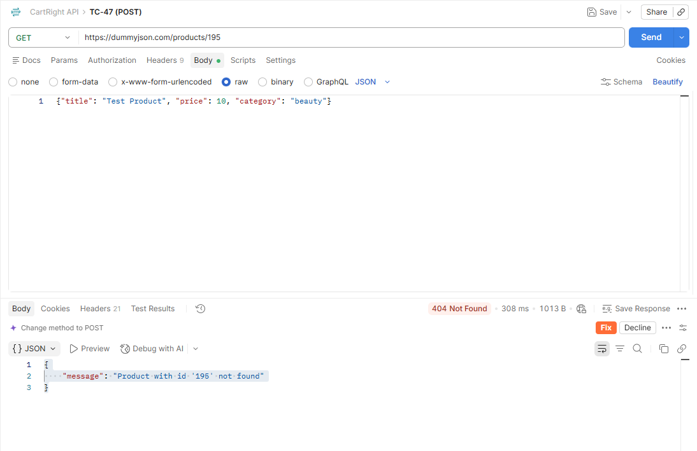
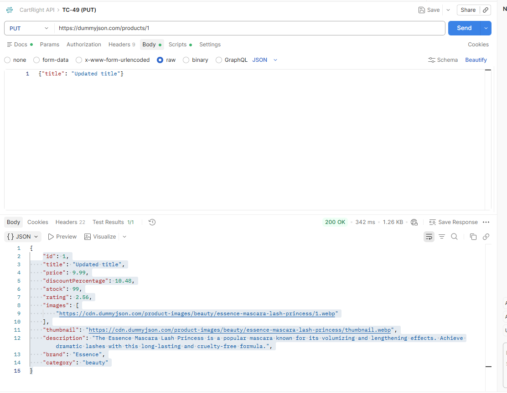
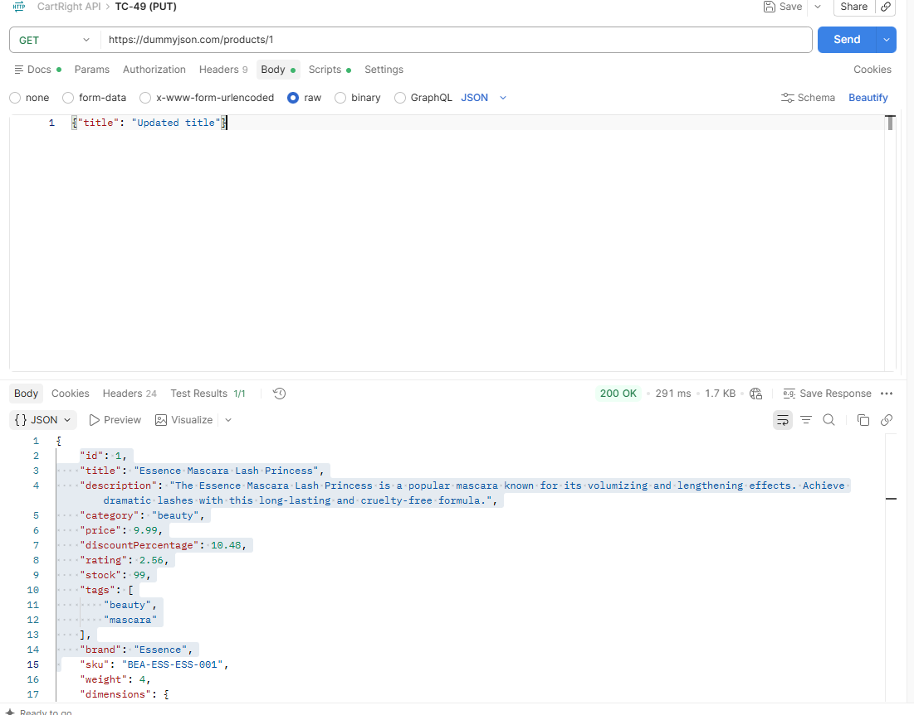
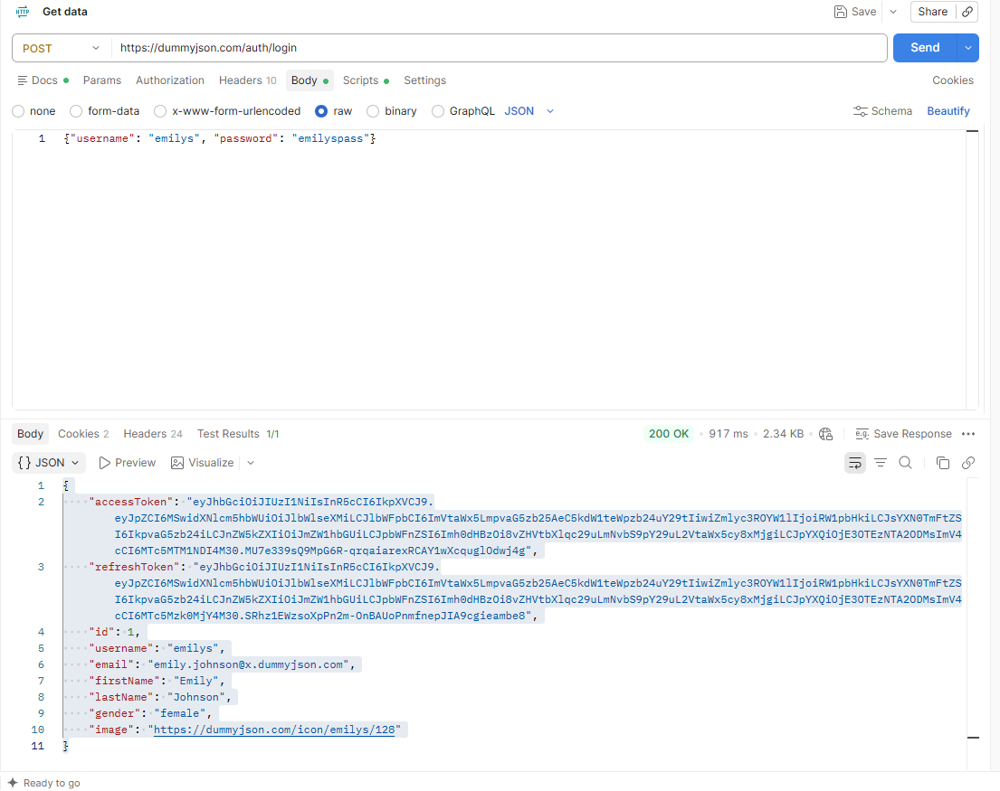
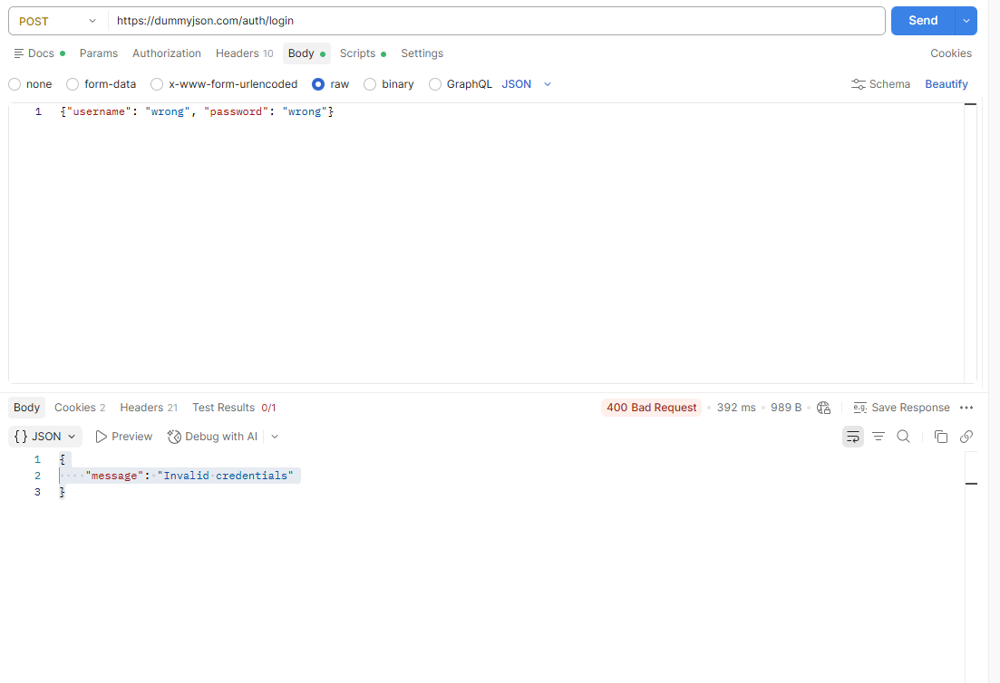

# API Testing - CartRight Retail

API testing with Postman against the **DummyJSON API** (https://dummyjson.com).

> **API change:** the API originally planned for this project was Fake Store API. It was unavailable during the testing window (Cloudflare error **521 - Web server is down**), so the API requirements and test cases were mapped to the equivalent endpoints of DummyJSON. Test case IDs are unchanged (see `01-requirements` and `05-test-cases`).

| | |
|---|---|
| **Date** | 2026-10-07 |
| **Tool** | Postman (collection "CartRight API") |
| **Base URL** | https://dummyjson.com |
| **Scenarios** | TS-13, TS-14, TS-15, TS-16 |
| **Requirements** | API-REQ-01 .. API-REQ-10 |
| **Result** | 12 test cases, 12 passed |

## Results

| Test case | Request | Expected | Actual | Result |
|---|---|---|---|---|
| TC-43 | GET /products | 200 OK; list of products | 200 OK; object with a `products` array (30 items) plus `total`, `skip`, `limit` | Pass |
| TC-44 | GET /products/1 | 200 OK; product with id = 1 | 200 OK; product with id = 1 | Pass |
| TC-45 | GET /products/9999 | 404 with an error message | 404; message "Product with id '9999' not found" | Pass |
| TC-47 | POST /products/add, then GET /products/195 | 201; new id; product not persisted | 201 Created, new id 195; GET /products/195 returns 404 (not persisted) | Pass |
| TC-49 | PUT /products/1, then GET /products/1 | 200 with updated title; change not persisted | 200 OK, title "Updated title"; the following GET still returns the original title | Pass |
| TC-51 | DELETE /products/1, then GET /products/1 | 200; `isDeleted: true`; product still exists | 200 OK, `isDeleted: true`; the following GET still returns the product | Pass |
| TC-52 | GET /products/categories | 200 OK; list of categories | 200 OK; array of 24 categories (slug, name, url) | Pass |
| TC-53 | GET /products/category/beauty | 200 OK; only products of category "beauty" | 200 OK; 5 products, all with category "beauty" | Pass |
| TC-55 | POST /auth/login (valid user) | 200 OK; access token | 200 OK; `accessToken` returned | Pass |
| TC-56 | POST /auth/login (invalid credentials) | 4xx; error message; no token | 400 Bad Request; "Invalid credentials"; no token | Pass |
| TC-58 | GET /users, GET /users/1 | 200 OK; users list; user with id = 1 | 200 OK; 30 users of 208 in total; user id 1 (username `emilys`) | Pass |
| TC-60 | GET /carts/user/1 | 200 OK; carts of user 1 | 200 OK; 1 cart with `userId` = 1; cart total (13037.88) equals the sum of its line totals | Pass |

## Key finding: write operations are not persisted
POST, PUT and DELETE return a success response, but the data does not change on the server (TC-47, TC-49, TC-51). DummyJSON is a mock service, so this is expected behaviour. It is documented here because a success response does **not** mean the data was changed; on a real API this would be a defect.

## Observation (not logged as a defect)
`GET /users/1` returns sensitive-looking fields in plain text: the **password**, bank card number and SSN. The data is fictional, so there is no real exposure. On a real system, exposing these fields through an API would be a serious security issue and should be reported.

## Evidence

### TC-43 - GET /products

### TC-45 - non-existent product

### TC-47 - POST creates a product, but it is not persisted

### TC-49 - PUT updates a product, but it is not persisted

### TC-55 - login with valid credentials

### TC-56 - login with invalid credentials

## Limitations
- The API under test is a mock service; write operations cannot be verified end to end.
- Only functional checks were done (status codes and response content); no performance or security testing of the API.
