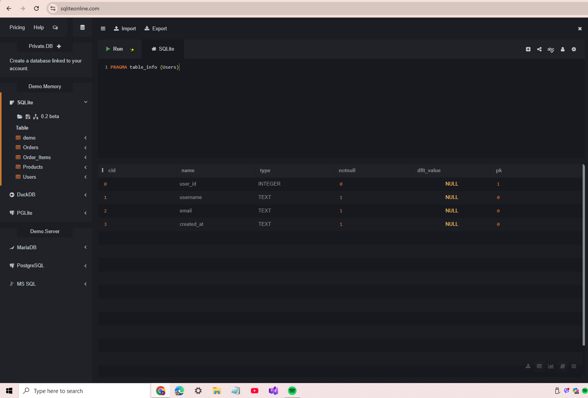
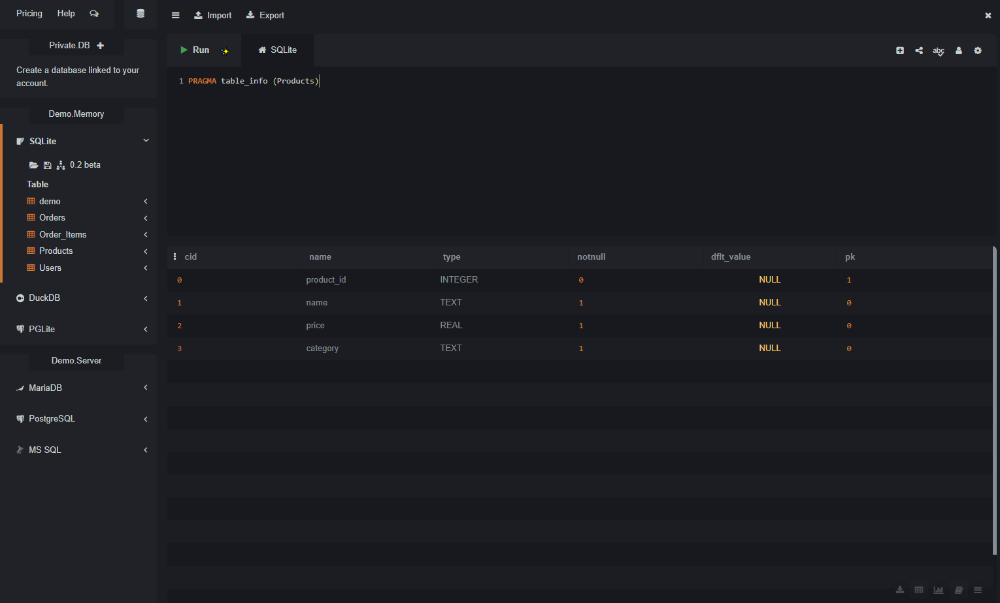
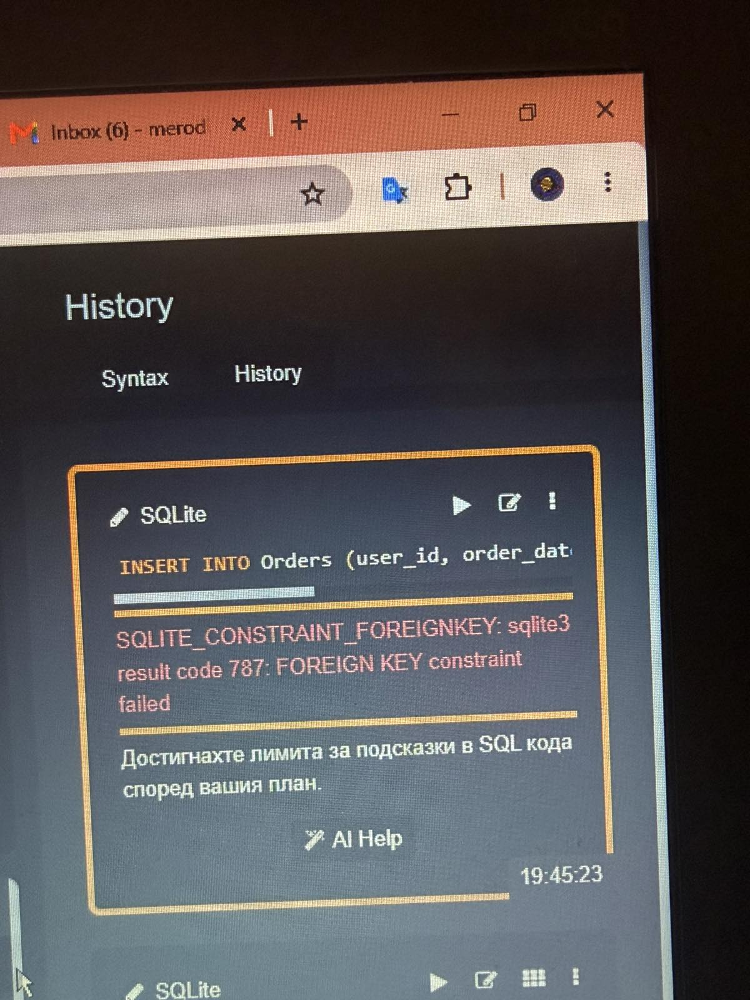
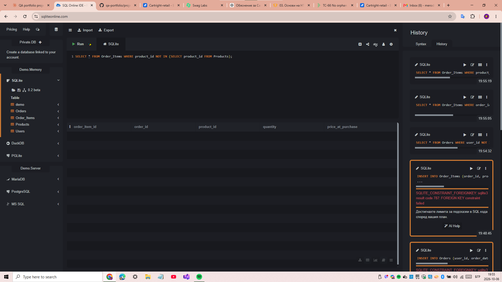
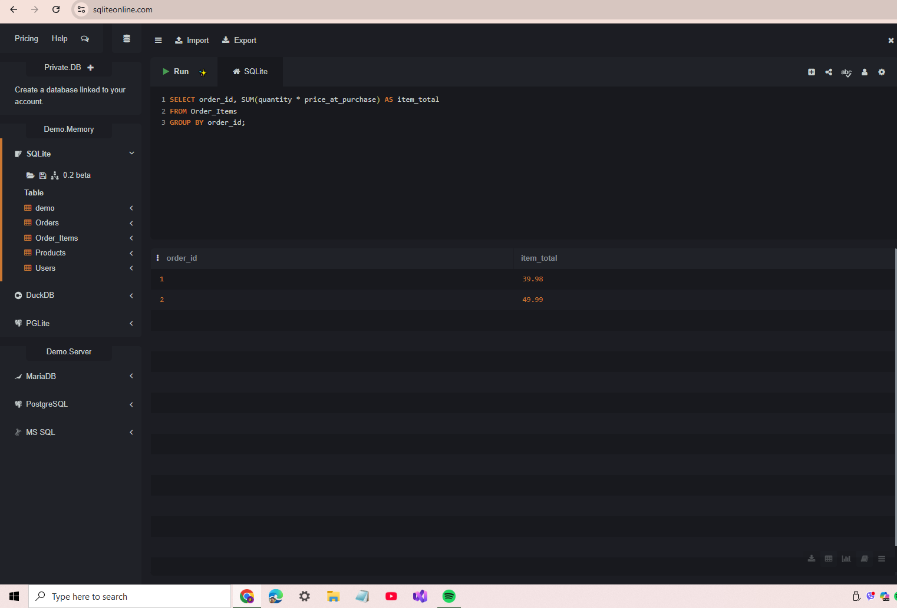
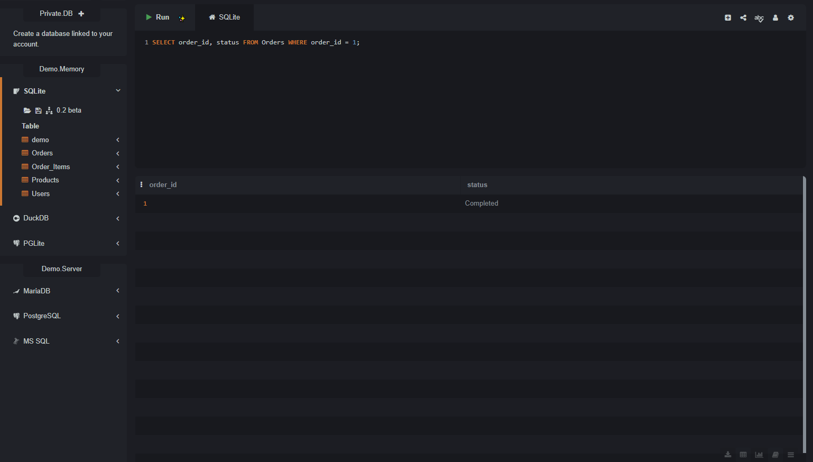

# Database Testing - Results

Database testing of the simulated CartRight schema (SQLite). The queries are in [sql-queries.sql](sql-queries.sql).

> **Note:** the schema is simulated and is **not** connected to SauceDemo. This section demonstrates database testing methodology (structure, constraints, data integrity), not verification of real UI-to-database data.

| | |
|---|---|
| **Scenarios** | TS-17, TS-18 |
| **Requirements** | DB-REQ-01 .. DB-REQ-05 |
| **Tool** | SQLite (sqliteonline.com) |
| **Result** | 7 test cases, 7 passed |

## Results

| Test case | What is checked | Result | Evidence |
|---|---|---|---|
| TC-62 | Users table structure | Pass | `table-info-users.png` |
| TC-63 | Products table structure | Pass | `table-info-products.png` |
| TC-64 | An order cannot reference a non-existent user (foreign key) | Pass | `foreign.jpg` |
| TC-65 | An order item cannot reference a non-existent order or product (foreign key) | Pass | `foreign.jpg` |
| TC-66 | No orphan records | Pass | `66.png` |
| TC-67 | Order total matches its line items; no price drift | Pass | `sum.png` |
| TC-68 | Order status is consistent and valid | Pass | `68.png` |

## Evidence

### TC-62 - Users table structure

### TC-63 - Products table structure

### TC-64 / TC-65 - Foreign key constraints

### TC-66 - No orphan records

### TC-67 - Order total consistency

### TC-68 - Order status

