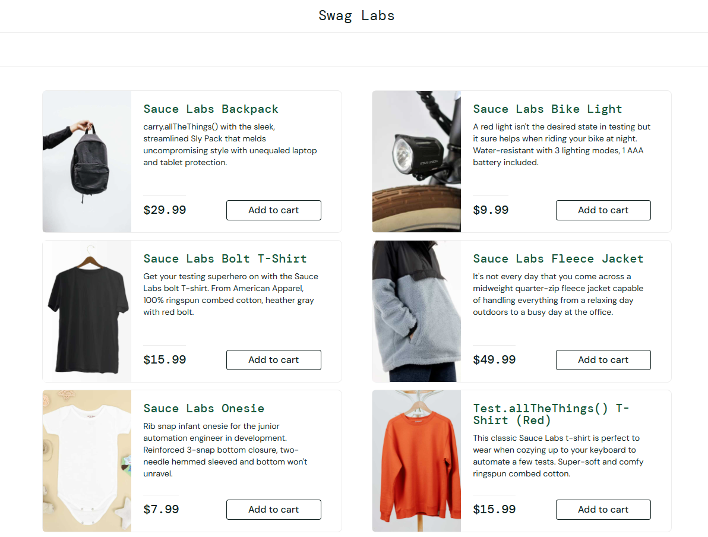

# BUG-001 - Product "Test.allTheThings() T-Shirt (Red)" displays an image of an orange long-sleeve shirt

| Field | Value |
|---|---|
| **Jira key** | CR-1 |
| **Reporter** | Lilyana Merodiyska |
| **Date reported** | 2026-10-06 |
| **Status** | Open |
| **Severity** | Medium |
| **Priority** | Medium |
| **Found in test case** | TC-17 (TestRail) |
| **Related scenario / requirement** | TS-05 / REQ-04 |
| **Environment** | https://www.saucedemo.com |
| **Browser / OS** | Chrome / Windows 11 |
| **Test account** | standard_user |
| **Reproducibility** | Always |

## Description
The image shown for "Test.allTheThings() T-Shirt (Red)" does not match the product. It shows an orange long-sleeve shirt instead of a red T-shirt. The same wrong image appears on both the Products page and the product detail page, which may mislead customers.

## Preconditions
- User is logged in as `standard_user`

## Steps to reproduce
1. Open https://www.saucedemo.com
2. Log in with username `standard_user` and password `secret_sauce`
3. On the Products page, find "Test.allTheThings() T-Shirt (Red)" and look at its image
4. Click the product name to open the detail page and look at the image

## Expected result
Each product displays an image that corresponds to its name (REQ-04). The image for "Test.allTheThings() T-Shirt (Red)" shows a red T-shirt.

## Actual result
An orange long-sleeve shirt is shown, both in the product list and on the product detail page.

## Evidence
- Products page: `screenshots/BUG-001-wrong-tshirt-image.png`
- Product detail page: `screenshots/BUG-001-wrong-tshirt-image-detail.png`

## Additional information
- Reproduced with `standard_user` on both the list page and the detail page.
- Workaround: none needed for the purchase flow; the product name and price are correct.

## Retest (fill in after the fix)
| Date | Build / Version | Result | Notes |
|---|---|---|---|
| | | PASS / FAIL | |
