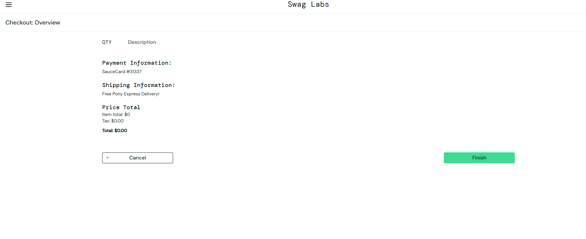

# BUG-002 — User can complete an order with an empty cart

| Field | Value |
|---|---|
| **Jira key** | CR-3 |
| **Reporter** | Lilyana Merodiyska |
| **Date reported** | 2026-10-06 |
| **Status** | Open |
| **Severity** | High |
| **Priority** | Medium |
| **Found in test case** | TC-41 (TestRail) |
| **Related scenario / requirement** | TS-20 / REQ-09 |
| **Environment** | https://www.saucedemo.com (Swag Labs) |
| **Browser / OS** | Chrome / Windows |
| **Test account** | standard_user |
| **Reproducibility** | Always |

## Description
The user can proceed through the whole checkout flow and complete an order with no products in the cart. The final total is $0.00.

## Preconditions
- User is logged in as `standard_user`
- The cart is empty (no badge number on the cart icon)

## Steps to reproduce
1. Open https://www.saucedemo.com and log in as `standard_user` (password: `secret_sauce`).
2. Make sure the cart is empty (no badge number on the cart icon).
3. Open the cart and click **Checkout**.
4. Fill in First Name, Last Name and Postal Code, then click **Continue**.
5. On the Overview page, click **Finish**.

## Expected result
The system prevents checkout when the cart is empty and displays an appropriate validation message.

## Actual result
The order is completed successfully with a total of $0.00 and the confirmation page is shown.

## Evidence
- Screenshot: `screenshots/BUG-002-checkout-with-empty-cart.png`

## Additional information
- Behaviour is not defined in the requirements; expected result is based on business logic (an order without items should not be possible). Found through TC-41 / exploratory scenario TS-20.
- Impact: orders with no items and a $0.00 total can be created, which would pollute order data in a real system.

## Retest (fill in after the fix)
| Date | Build / Version | Result | Notes |
|---|---|---|---|
| | | PASS / FAIL | |
