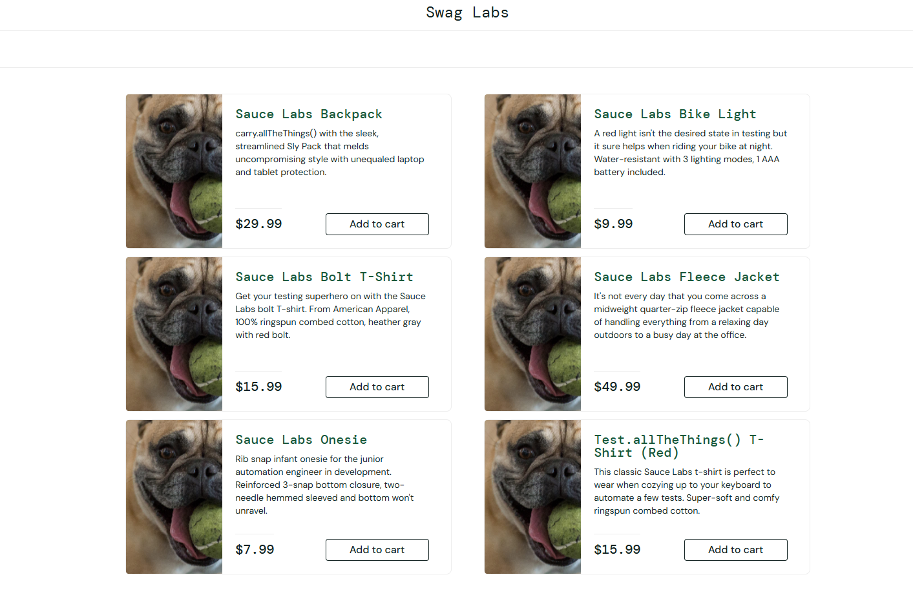

# BUG-003 - All products show the same dog image (problem_user)

| Field | Value |
|---|---|
| **Jira key** | CR-4 |
| **Reporter** | Lilyana Merodiyska |
| **Date reported** | 2026-10-07 |
| **Status** | Open |
| **Severity** | Medium |
| **Priority** | Medium |
| **Found in** | Exploratory session 2 (`problem_user`), related test case TC-16 / TC-17 |
| **Related scenario / requirement** | TS-05 / REQ-04 |
| **Environment** | https://www.saucedemo.com |
| **Browser / OS** | Chrome / Windows |
| **Test account** | problem_user |
| **Reproducibility** | Always |

## Description
On the Products page every product shows the same picture of a dog, which does not match any product name.

## Preconditions
- Logged in as `problem_user`

## Steps to reproduce
1. Open https://www.saucedemo.com
2. Log in as `problem_user` (password: `secret_sauce`)
3. Look at the images on the Products page

## Expected result
Each product shows an image that corresponds to its name (REQ-04).

## Actual result
All 6 products show the same picture of a dog.

## Evidence

## Additional information
- With `standard_user` the images are different (only one image is wrong, see BUG-001). `problem_user` is an account of the demo site that is built to show defects.

## Retest (fill in after the fix)
| Date | Build / Version | Result | Notes |
|---|---|---|---|
| | | PASS / FAIL | |
