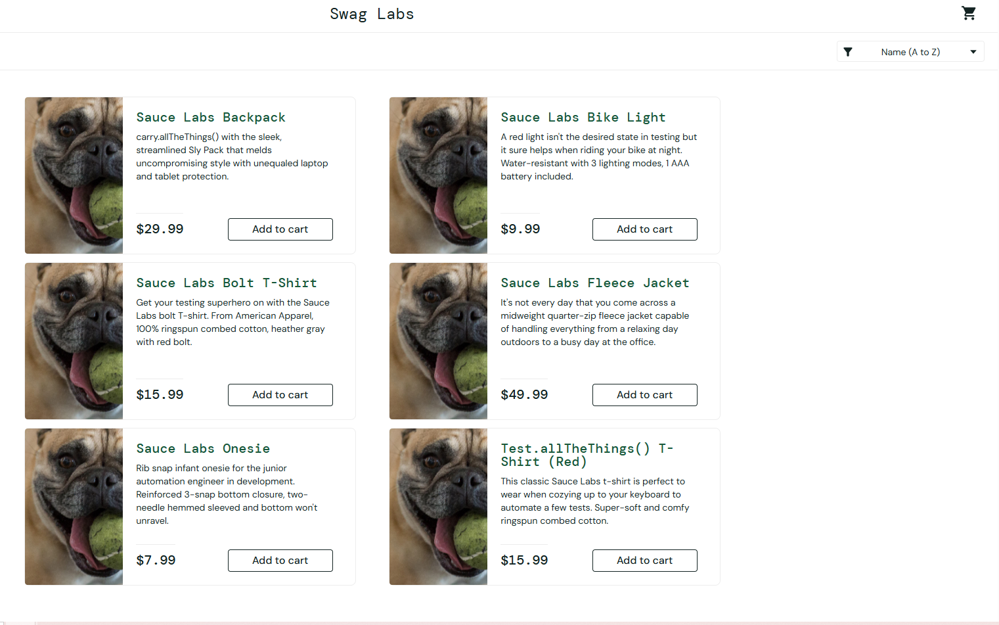

# BUG-004 - Product sorting does not work (problem_user)

| Field | Value |
|---|---|
| **Jira key** | CR-5 |
| **Reporter** | Lilyana Merodiyska |
| **Date reported** | 2026-10-07 |
| **Status** | Open |
| **Severity** | High |
| **Priority** | Medium |
| **Found in** | Exploratory session 2 (`problem_user`), related test case TC-19 / TC-20 |
| **Related scenario / requirement** | TS-06 / REQ-05 |
| **Environment** | https://www.saucedemo.com |
| **Browser / OS** | Chrome / Windows |
| **Test account** | problem_user |
| **Reproducibility** | Always |

## Description
The sort dropdown on the Products page has no effect: the products always stay in the default order.

## Preconditions
- Logged in as `problem_user`

## Steps to reproduce
1. Open https://www.saucedemo.com
2. Log in as `problem_user` (password: `secret_sauce`)
3. On the Products page choose "Name (Z to A)" in the sort dropdown
4. Choose "Price (low to high)"

## Expected result
Products are re-ordered according to the selected option (REQ-05).

## Actual result
The order does not change. Products stay in the default A to Z order for both options.

## Evidence

## Additional information
- With `standard_user` sorting works (TC-18 to TC-21 passed).

## Retest (fill in after the fix)
| Date | Build / Version | Result | Notes |
|---|---|---|---|
| | | PASS / FAIL | |
