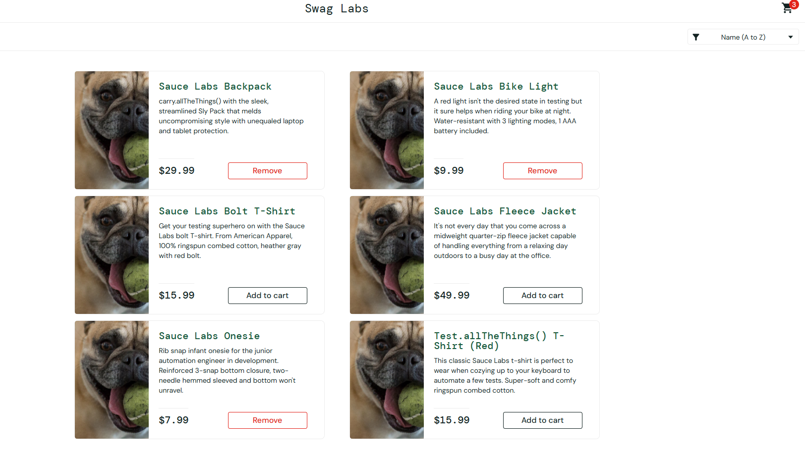

# BUG-005 - "Add to cart" does nothing for some products (problem_user)

| Field | Value |
|---|---|
| **Jira key** | CR-6 |
| **Reporter** | Lilyana Merodiyska |
| **Date reported** | 2026-10-07 |
| **Status** | Open |
| **Severity** | High |
| **Priority** | High |
| **Found in** | Exploratory session 2 (`problem_user`), related test case TC-23 |
| **Related scenario / requirement** | TS-07 / REQ-06 |
| **Environment** | https://www.saucedemo.com |
| **Browser / OS** | Chrome / Windows |
| **Test account** | problem_user |
| **Reproducibility** | Always |

## Description
On the Products page "Add to cart" does not work for 3 of the 6 products, so the user cannot buy them.

## Preconditions
- Logged in as `problem_user`
- The cart is empty

## Steps to reproduce
1. Open https://www.saucedemo.com
2. Log in as `problem_user` (password: `secret_sauce`)
3. On the Products page click "Add to cart" on each of the 6 products, one by one
4. After each click check the button and the cart badge

## Expected result
Every product is added; the button changes to "Remove" and the cart badge increases (REQ-06).

## Actual result
"Add to cart" does nothing for Sauce Labs Bike Light, Sauce Labs Fleece Jacket and Test.allTheThings() T-Shirt (Red). The other 3 products are added.

## Evidence

## Additional information
- With `standard_user` all products can be added.
- Impact: the customer cannot order half of the catalogue (lost sales).

## Retest (fill in after the fix)
| Date | Build / Version | Result | Notes |
|---|---|---|---|
| | | PASS / FAIL | |
